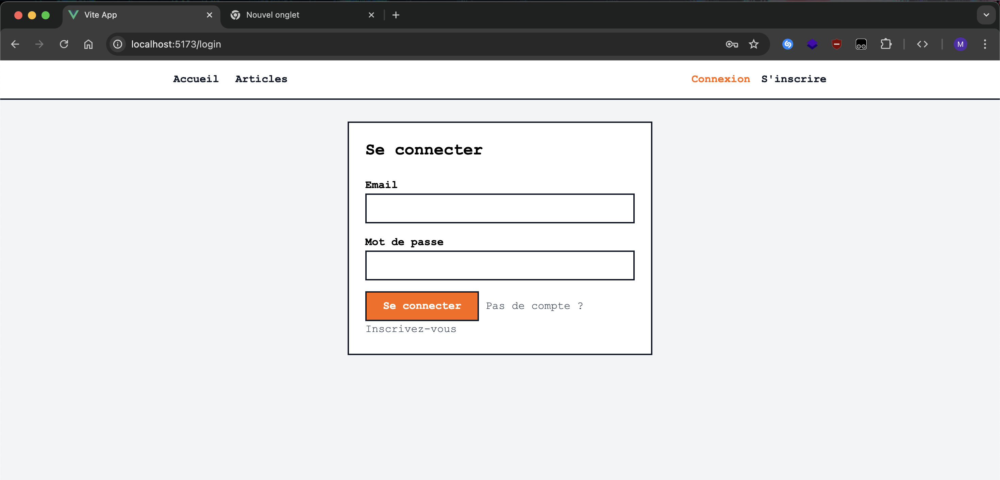
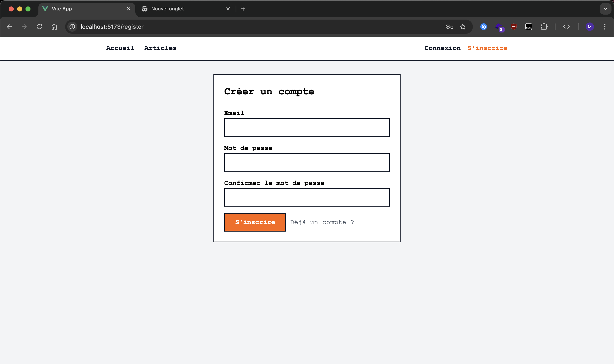
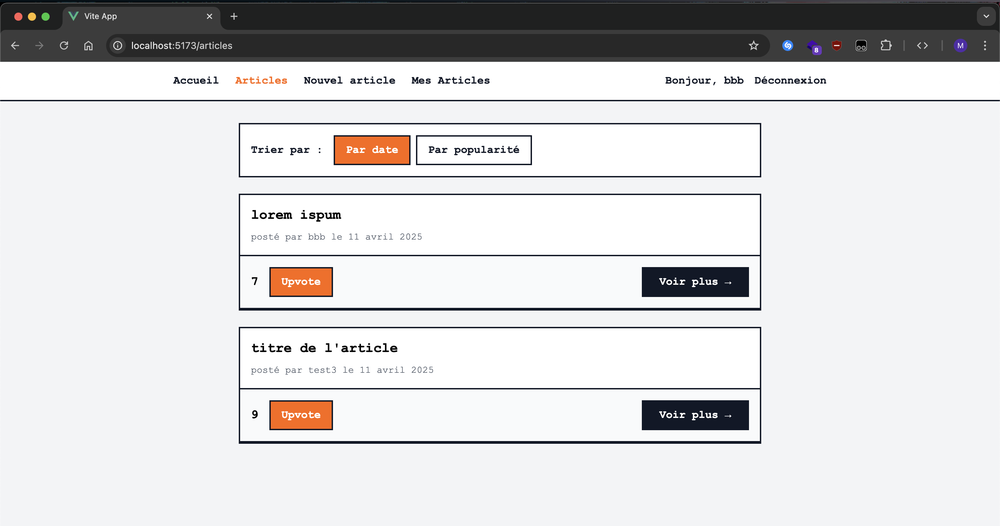
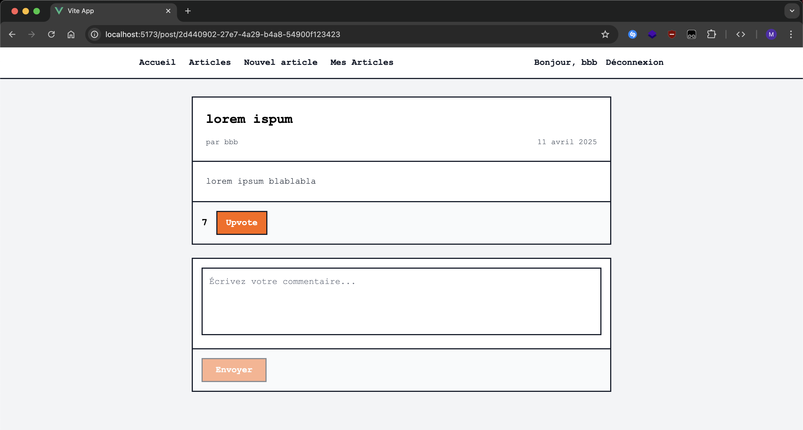
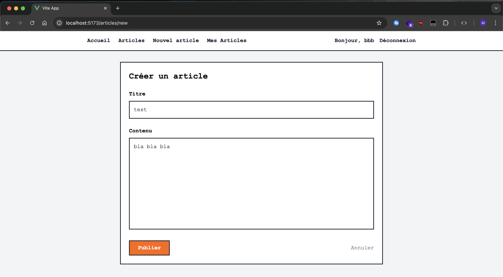
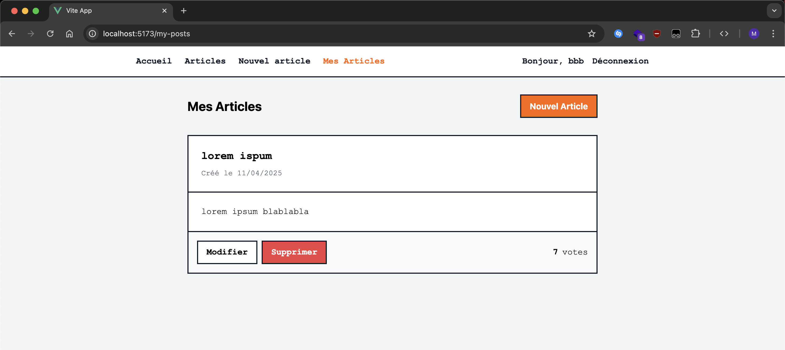

# Frontend - Social Network App

This frontend is a Vue 3 application using strict TypeScript, Apollo Client, and GraphQL Codegen. It allows users to register, log in, publish posts, comment, like, and view others' posts in a clean interface like a clone of Hacker News.

## Screenshots of the Application

### Login
Login using email and password:



### Register
Form to create a new account:



### Articles Homepage
Shows all articles sorted by date or popularity (likes):



### Article Details
View full content, like a post, and add a comment:



### Create a New Article
A simple form to publish a new post:



### My Articles
View, edit, or delete your own posts:



---

## Features

### JWT Authentication
- Register and log in
- Store JWT token and user info locally
- Logout

### Posts
- Create, edit, and delete posts
- List view with sorting by date or popularity

### Interactions
- Like posts
- Comment on posts

---

## Tech Stack
- **Framework**: Vue 3 + Vite
- **Language**: TypeScript (strict mode)
- **GraphQL**: Apollo Client + GraphQL Codegen
- **State Management**: Pinia
- **Routing**: Vue Router

---

## Getting Started

```bash
git clone our project
cd client
npm install
npm run dev
```


Make sure the GraphQL server is running in the `server/` folder.

---

## Usefull commands

Generates TypeScript types and hooks based on your GraphQL schema and queries.
```bash
npx grphql-codegen
```

---

## Project Structure

```
client/
├── components/         # Vue components (cards, filters, buttons, etc.)
├── pages/              # Main pages (login, register, articles, etc.)
├── stores/             # Pinia stores (authStore)
├── gql/                # Generated types and queries from GraphQL Codegen
├── router/             # Router configuration
└── App.vue             # App root
```

---

## Best Practices Followed
- Strict TypeScript without `any`
- `graphql-codegen` for types and hooks
- Basic responsive design and accessibility
- Clean and maintainable code

---

## Features we want to fix or upgrade
- Move likedPostId to backend and add it into our database
- Move graphql requests in a dedicated service to avoid duplicates
- graphql function getUserPosts is currently filtering on authorName instead of authorId
- Add a function getUserById in backend
- Fix FilterBar